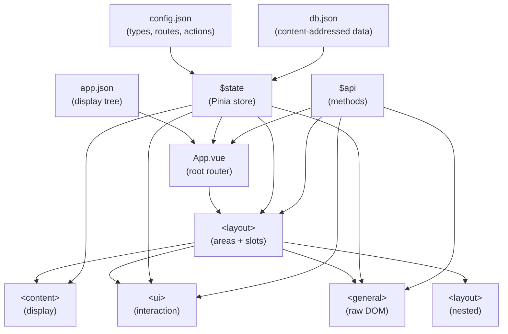

# xmbl

# XMBL

XMBL is a **JSON-driven application generator** built on Vue 3 + Pinia. An entire app — its layouts, UI controls, content, routing, and logic — is declared as JSON and rendered dynamically at runtime. There is no traditional Vue template authoring; instead, four meta-components (`layout`, `ui`, `content`, `general`) interpret JSON descriptors and compose themselves into a live application. Data integrity is enforced through a type system with content-addressed hashing (SHA-256 "micromining"), and all state is held in a single reactive Pinia store (`$state`) manipulated exclusively through a functional API layer (`$api`).

---

## 1. The Type System

Types are defined in [config.json](file:///Users/34r7h/Developer/projects/xmbl/public/defaults/config.json) under `types`. Each type is keyed by a numeric code (`"0"` – `"9"`), and its value is an object whose keys are required property names and whose values are the expected JavaScript type-strings (`"string"`, `"number"`, `"array"`, `"object"`).

The `lexicon` array maps codes to human-readable names:

| Code | Name | Purpose |
|------|------|---------|
| `0` | **datum** | The universal envelope — every stored record is a datum |
| `1` | **app** | Top-level application definition |
| `2` | **component** | A UI/content/layout component descriptor |
| `3` | **update** | A diff/patch operation against existing data |
| `4` | **action** | A named, testable function with inputs/outputs |
| `5` | **event** | A scheduled or reactive trigger that fires actions |
| `6` | **tx** | A content-addressed transaction (paid activity / value transfer) |
| `7` | **pointer** | A directional link between data nodes |
| `8` | **trait** | A behavioral modifier/mixin for types |
| `9` | **type** | A meta-type — used to define new custom types |

---

### 1.1 Type `0` — Datum (the universal record)

Every piece of data stored in `$state.db.data` is a datum. The datum is the **envelope** that wraps typed payloads.

| Property | Type | Description |
|----------|------|-------------|
| `xid` | `string` | External identifier / lookup key |
| `oid` | `string` | SHA-256 hash of the original content (the "object id") |
| `type` | `number` | Numeric type code (`0`–`9`) of the wrapped data |
| `nonce` | `number` | Micromining nonce — iterated until the hash prefix matches the type code |
| `hooks` | `object` | Lifecycle hooks: `{before: array, watch: array, after: array}` |
| `time` | `number` | Timestamp |
| `data` | `object` | The actual payload, validated against the schema of `type` |

> [!IMPORTANT]
> The stored key in `db.data` is `${micromined_hash}_${nonce}`, which embeds the type code as a prefix (`"02..."` = component, `"07..."` = pointer, etc.). This makes type membership visible from the key alone.

---

### 1.2 Type `1` — App

Defines a top-level application.

| Property | Type | Description |
|----------|------|-------------|
| `datums` | `array` | References to all datum records belonging to the app |
| `deploy` | `array` | Deployment configuration / targets |
| `index` | `object` | Lookup index for fast datum access |
| `config` | `object` | App-level configuration (types, routes, actions, etc.) |
| `scopes` | `object` | Scoped state tree for component data binding |
| `stack` | `array` | Action call stack |
| `accounts` | `object` | User/account data |
| `token` | `string` | App authentication/identity token |

---

### 1.3 Type `2` — Component

Stores a component's definition for content-addressable retrieval.

| Property | Type | Description |
|----------|------|-------------|
| `type` | `string` | The Vue component name to render: `"content"`, `"ui"`, `"layout"`, or `"general"` |
| `props` | `object` | The full `x`-prefixed props object passed to the component (e.g., `{xid, xtype, xlabel, ...}`) |

---

### 1.4 Type `3` — Update

Represents a diff/patch operation.

| Property | Type | Description |
|----------|------|-------------|
| `target` | `string` | URI or hash of the datum to update |
| `diffops` | `array` | Array of diff operations to apply |
| `elements` | `object` | Elements affected by the update |

---

### 1.5 Type `4` — Action

A named, composable function.

| Property | Type | Description |
|----------|------|-------------|
| `name` | `string` | Human-readable action identifier |
| `inputs` | `object` | Schema describing expected input parameters |
| `commands` | `array` | Ordered list of command strings / operations |
| `tests` | `array` | Test cases for validation |
| `outputs` | `object` | Schema describing return values |

---

### 1.6 Type `5` — Event

A scheduled or reactive trigger.

| Property | Type | Description |
|----------|------|-------------|
| `schedule` | `object` | Timing/cron configuration |
| `name` | `string` | Event identifier |
| `actions` | `array` | Action references to fire when triggered |
| `data` | `object` | Payload data passed to actions |

---

### 1.7 Type `6` — Tx / Value Unit

A content-addressed value unit (a **paid activity** / value transfer / token / asset), micromined to the `06` type prefix. The `unspent` prop splits type-6 into **fungible tokens (UTXO-style)** and **non-fungible assets**. Per the payment-based rule: paid activity → type-6; non-paid → type-7 pointer.

| Property | Type | Description |
|----------|------|-------------|
| `chain` | `string` | Target chain id (e.g. `xmbl`, `base-sepolia`) |
| `from` | `array` | Payer party ref(s) — sender / debited |
| `to` | `array` | Payee party ref(s) — recipient / credited |
| `asset` | `string` | Asset / contract id moved |
| `amount` | `string` | Quantity moved (decimal-string — preserves precision) |
| `seq` | `number` | Payer's monotonic sequence (anti-replay; distinct from the mining nonce) |
| `prev` | `string` | Pointer to the payer's prior tx xid — the tx-chain link (ordering + provenance); `""` for genesis |
| `unspent` | `string` | The value unit's denomination at mint — **immutable**. **Fungible** tokens (UTXO-style) carry spendable value here and are consumed by a type-7 **spend-pointer** referencing this xid as input (spent-ness is *derived* from the spend graph, never by mutating this datum). **Non-fungible** assets are whole units transferred by an ownership pointer, not consumed UTXO-style. `""` when not a value-bearing unit |

---

### 1.8 Type `7` — Pointer

A directional link between data nodes. This is the system's **graph edge** primitive.

| Property | Type | Description |
|----------|------|-------------|
| `from` | `array` | Source node references (URIs, hashes, state paths) |
| `to` | `array` | Destination node references |
| `how` | `string` | Relationship type (e.g., `"route"`, `"doubt"`, or custom) |

> [!NOTE]
> Pointers with `how: "route"` are used for client-side routing. The `from` array contains URL path segments; the `to` array contains datum hashes of layout components to render.

---

### 1.9 Type `8` — Trait

A behavioral modifier.

| Property | Type | Description |
|----------|------|-------------|
| `type` | `string` | The kind of trait |
| `updates` | `array` | Modifications/enhancements this trait applies |

---

### 1.10 Type `9` — Type (meta-type)

Used to define **new** custom types at runtime. (may not use 00-09)

| Property | Type | Description |
|----------|------|-------------|
| `name` | `string` | Human-readable type name |
| `model` | `object` | Property schema (keys = property names, values = type-strings) |
| `prefix` | `string` | Hash prefix code for micromining |

---

## 2. Application Composition

### 2.1 Architecture Overview



### 2.2 The Display Tree

An app is defined in [app.json](file:///Users/34r7h/Developer/projects/xmbl/public/defaults/app.json) under `display`. This is a **named-area → component-list** map:

```json
{
  "display": {
    "<area-name>": {
      "style": { ... },
      "components": [
        { "type": "content|ui|layout|general", "props": { "xid": "...", ... } },
        ...
      ]
    }
  }
}
```

### 2.3 Rendering Pipeline

1. **[main.js](file:///Users/34r7h/Developer/projects/xmbl/src/main.js)** — Registers global components (`content`, `ui`, `layout`, `general`), creates Pinia store, and provides `$state` + `$api` via Vue's `inject`/`provide`.

2. **[App.vue](file:///Users/34r7h/Developer/projects/xmbl/src/App.vue)** — Parses the URL, hashes the path, checks `$state.routes` for a matching pointer. If found, renders the pointed-to layout. Otherwise renders the default `$state.app` display tree.

3. **[layout.vue](file:///Users/34r7h/Developer/projects/xmbl/src/components/layout.vue)** — Receives `xdisplay` (the display tree). Iterates over `display` areas, creating a DOM element for each. Within each area, iterates `components[]` and dynamically renders them via `<component :is="...">`.

4. **[content.vue](file:///Users/34r7h/Developer/projects/xmbl/src/components/content.vue)** — Renders read-only content: HTML, markdown, text, images, video, audio, tables, lists, iframes, embeds. Supports `xpoint` for pointer resolution and `xstate` for scoped state binding.

5. **[ui.vue](file:///Users/34r7h/Developer/projects/xmbl/src/components/ui.vue)** — Renders interactive controls: text inputs, selects, buttons, arrays, objects, textareas, and all HTML5 input types. Handles data binding via scoped state, type coercion via `xstruct`, and action dispatch via `xactions`.

6. **[general.vue](file:///Users/34r7h/Developer/projects/xmbl/src/components/general.vue)** — Renders arbitrary DOM trees from `xelements` descriptors using Vue's `h()` render function. Supports custom event handlers via `xmethods`.

### 2.4 Scoping

Every component gets a **scope** — a dot-path in `$state.scopes` that acts as its private namespace:

```
$state.scopes.<layout-token>.<area-name>.<component-xid>
```

- The layout token is a micromined hash of the display config.
- `xparent` overrides the default parent scope.
- Scope is used as the default `uri` for `$api.get()` / `$api.set()` within that component.

### 2.5 Routing

Routes are type-7 pointers stored in `config.routes[]`:

```json
{ "from": ["hello"], "how": "route", "to": ["022585b7..."] }
```

During `init()`, pointers are hashed by their `from` path and stored in `$state.routes.<hash>`. When the URL changes, `App.vue` hashes the current path and looks up the matching route. The `to` value is a content-addressed datum hash pointing to a layout component stored in `db.data`.

---

### 2.6 Detailed Component Types & Props Reference

XMBL relies on four core meta-components. Every component accepts shared base props, as well as type-specific props and descriptors.

#### 2.6.1 Shared Props (All Components)

The following properties are supported across all four meta-components (`content`, `ui`, `layout`, `general`):

| Prop Name | Accepted Types | Required | Description |
|-----------|----------------|----------|-------------|
| `xid` | `String` | **Yes** | Unique component identifier. Serves as key in scope dot-paths (`$state.scopes.<token>.<area>.<xid>`), DOM `id` attributes, and state targeting. |
| `xif` | `Array<String>` | No | Conditional rendering expression array. Evaluated sequentially via `$api.utils({ utype: 'validate', udata: { val: [...xif] } })`. If any expression evaluates to false, the component is hidden. |
| `xstyle` | `String \| Object` | No | Inline CSS styles applied to the root element/wrapper. |
| `xclass` | `String` | No | CSS class names applied to the root element/wrapper. |
| `xparent` | `String` | No | Overrides the automatic parent scope dot-path for component scoping. |
| `xname` | `String` | No | Human-readable label or alt-text descriptor (e.g. `alt` attribute for `image` content). |
| `xevents` | `Object` | No | Object containing event listener bindings passed to underlying Vue elements. |
| `xadmin` | `Boolean \| Number \| String` | No | When truthy, overlays an absolute-positioned admin action button (e.g., `"SAVE CONTENT"`, `"SAVE UI"`, `"SAVE LAYOUT"`). |

---

#### 2.6.2 `<content>` Component Deep Dive

The `content` meta-component renders read-only media, formatted text, tabular datasets, lists, and external embeds. It also allows mounting nested meta-components.

##### Source Resolution Algorithm
The internal reactive `source` value is computed using the following priority chain:
1. **Pointer Resolution (`xpoint`)**: If `xpoint` is supplied, fetches data using `$api.get({ uri: props.xpoint, provider: '@' })`.
2. **Scoped State (`xstate`)**: If `xstate` is supplied, parses path array segments. Segments prefixed with `$_` (e.g., `$_actiontype`) are dynamically resolved from the component's parent scope (`scopes.<parent_scope>.<segment_without_$_>`). The resulting path array is queried via `$api.get({ uri: scopedvalues })`.
3. **Dynamic Function (`xvalue`)**: If `xvalue` is a function, executes `xvalue(xdata)` and uses the return value.
4. **Static Value (`xvalue`)**: Uses `props.xvalue` directly.

##### Subtypes (`xtype`) and Props

| Subtype (`xtype`) | Rendered DOM Output & Sanitization | Notes / Prop Usage |
|-------------------|-----------------------------------|-------------------|
| `"text"`, `"number"`, `"bool"` | `<span>{{ source }}</span>` | Renders plain text string representations of numbers, booleans, or strings. |
| `"html"` | `<span v-html="purify.sanitize(source)"></span>` | Sanitizes HTML markup using `isomorphic-dompurify`. |
| `"markdown"` | `<span v-html="purify.sanitize(marked.parse(source))"></span>` | Parses Markdown via `marked` and sanitizes HTML output via `DOMPurify`. |
| `"image"` | `` | Display image assets. |
| `"video"` | `<video controls><source :src="source" /></video>` | HTML5 video player element. |
| `"audio"` | `<audio controls><source :src="source" /></audio>` | HTML5 audio player element. |
| `"table"` | `<table>...</table>` | Tabular data renderer. Supports `xcolumns` for custom headers and `xorder` for cell re-ordering. Accepts array-of-arrays, array-of-objects, or key-value object datasets. |
| `"olist"` | `<ol><li v-for="item in source" v-html="purify.sanitize(item)">` | Ordered list of sanitized items. |
| `"ulist"` | `<ul><li v-for="item in source" v-html="purify.sanitize(item)">` | Unordered list of sanitized items. |
| `"iframe"` | `<iframe :src="source" frameborder="0"></iframe>` | Embedded webpage/frame element. |
| `"embed"` | `<embed :src="source" />` | External media object embed element. |
| `"content"`, `"layout"`, `"ui"`, `"general"` | `<component :is="xtype" v-bind="{...xbind, ...xevents}" />` | Dynamically renders a nested meta-component, forwarding props via `xbind`. |

##### Component Props Reference for `<content>`

| Prop | Type | Default | Description |
|------|------|---------|-------------|
| `xtype` | `String` | **Required** | Content subtype (`"text"`, `"html"`, `"markdown"`, `"image"`, `"video"`, `"audio"`, `"table"`, `"olist"`, `"ulist"`, `"iframe"`, `"embed"`, or nested meta-component name). |
| `xvalue` | `String \| Number \| Object \| Array \| Boolean \| Function` | `undefined` | Direct value payload, HTML string, list items array, or compute function `xvalue(xdata)`. |
| `xstate` | `Array<String>` | `undefined` | Dot-path segment array into `$state`. Supports `$_` prefix for dynamic sibling-scope key resolution. |
| `xpoint` | `String` | `undefined` | Datum hash string. Triggers pointer resolution (`provider: "@"`). |
| `xdata` | `Any` | `undefined` | Input argument passed to `xvalue` when `xvalue` is a function. |
| `xbind` | `Object` | `undefined` | Props object forwarded to nested meta-components when `xtype` is `"content"`, `"layout"`, `"ui"`, or `"general"`. |
| `xcolumns` | `Array<String>` | `undefined` | Header titles or key names array for `table` subtype rendering. |
| `xorder` | `Array<Number>` | `undefined` | Column index order array for table cell sorting/ordering. |

---

#### 2.6.3 `<ui>` Component Deep Dive

The `ui` meta-component renders interactive form controls, handles two-way state binding, enforces runtime type coercion, and dispatches actions.

##### State Scoping & Two-Way Binding
- **Scope Construction**: `scope = (props.xparent ? props.xparent + '.' + props.xid : props.xid).split('.')`.
- **Initialization**: If `props.xdata` is defined, `$api.set({ uri: scope, value: props.xdata })` seeds state on component mount.
- **Input Sync**: On user input (`@input`, `@change`), `$api.set({ uri: scope, value: model })` persists values directly back to state.

##### Subtypes (`xtype`)

- **HTML5 Input Controls**: `"text"`, `"string"`, `"checkbox"`, `"color"`, `"date"`, `"datetime-local"`, `"email"`, `"file"`, `"month"`, `"number"`, `"password"`, `"radio"`, `"range"`, `"search"`, `"tel"`, `"time"`, `"url"`, `"week"`.
- **Textarea**: `"textarea"` — Renders a multi-line text input control.
- **Select Dropdown**: `"select"` — Renders a dropdown menu populated by `props.xoptions` (array of `{ name, value, selected?: boolean }`).
- **Button**: `"button"` — Dispatches `xactions` or `xaction` when clicked.
- **Structured Object Editor**: `"object"` — Renders a nested key-value property editor with interactive property addition, deletion, and raw JSON editing toggles.
- **Structured Array Editor**: `"array"` — Renders an indexed array item editor with add item, remove item, and raw JSON editing toggles.
- **State Browser**: `"state"` — Interactive state hierarchy picker.

##### Component Props Reference for `<ui>`

| Prop | Type | Default | Description |
|------|------|---------|-------------|
| `xtype` | `String` | `"text"` | UI control subtype name. |
| `xlabel` | `String \| Number` | `undefined` | Text for form `<label>` wrapper or button text. |
| `xvalue` | `String` | `undefined` | Scope property key or explicit target value to extract from scope. |
| `xdata` | `Any` | `undefined` | Initial/default data value seeded into `$state.scopes` on mount. |
| `xaction` | `String` | `undefined` | Name of single `$api` method (`"get"`, `"set"`, `"remove"`, `"api"`, `"utils"`) called on click. Uses `xdata` or parent scope as argument. |
| `xactions` | `Array<Object> \| String` | `undefined` | Action execution stack array (e.g. `[{set: {...}}, {api: {...}}]`) or datum hash string referencing action commands in `db.data`. Executed on button click via `$api.api()`. |
| `xoptions` | `Array<{name: string, value: string}>` | `undefined` | Option objects array for `select` subtype dropdowns. |
| `xstruct` | `String \| Boolean` | `false` | When truthy, enables the interactive type coercion selector dropdown (`string`, `number`, `boolean`, `array`, `object`, `function`). |
| `xmodel` | `String \| Object` | `undefined` | State path or model object schema used in Mode `m` for dynamic form generation. |
| `xmode` | `String` | `""` | Initial interaction mode (`"i"`, `"f"`, `"s"`, `"p"`, `"m"`, `"c"`, `"x"`). |
| `xscope` | `Array<String> \| String` | `undefined` | State path string or array for nested state browsing in Mode `s`. |
| `xstate` | `String \| Object` | `undefined` | Explicit state object subtree passed to state picker in Mode `s`. |
| `xcount` | `Number` | `undefined` | Iteration count property. |
| `xrequired` | `String` | `undefined` | Validation descriptor string. |

---

#### 2.6.4 `<ui>` Component Modes (`xmode` / `mode`) Deep Dive

The `<ui>` component supports selectable interaction modes (`xmode` prop or inline `mode` selector):

```
+-------------------------------------------------------------------+
| Mode  | Selector Label | Functional Description                   |
+-------+----------------+------------------------------------------+
| 'i'   | Input          | Standard HTML form inputs & textareas    |
| 'f'   | F(x)           | Function/eval expression input           |
| 's'   | State          | Reactive state path browser & picker     |
| 'p'   | Pointer        | Content-addressed datum pointer selector |
| 'm'   | Model          | Dynamic schema-driven form generator     |
| 'c'   | Content/UX     | Structural UI configuration mode         |
| 'x'   | UX             | Visual UX customization mode             |
+-------------------------------------------------------------------+
```

1. **Input Mode (`"i"`)**: Standard interactive form controls (`<input>`, `<textarea>`, `<select>`). Directly binds user inputs to local reactive models and state scope paths.
2. **State Mode (`"s"`)**: State hierarchy inspector. Renders dropdown options for inspecting keys in `$state` or `props.xstate`. Clicking the `«` button generates scoped state bindings with `$_` prefixes (e.g. `$_actiontype`), binding sibling scope selections dynamically.
3. **Model Mode (`"m"`)**: Schema-driven form generator. Queries the type model referenced by `xmodel` (e.g., `$state.config.types["1"]`), iterates through all defined properties, and dynamically instantiates child `<ui>` components for each key based on expected property types.
4. **Function Mode (`"f"`)**: Function expression definition mode. Used when binding functional evaluations or custom scripts directly to component events.
5. **Pointer Mode (`"p"`)**: Pointer reference mode. Used to select, input, or resolve content-addressed SHA-256 datum hashes.
6. **UX Modes (`"c"`, `"x"`)**: Layout and UX structural configuration modes.

---

#### 2.6.5 `<layout>` Component Deep Dive

The `layout` meta-component reads a `DisplayTree` object, generates content-addressed micro hash tokens, renders named container areas, and populates slots with component lists.

##### Props Reference for `<layout>`

| Prop | Type | Required | Description |
|------|------|----------|-------------|
| `xdisplay` | `DisplayTree` | **Yes** | Display tree descriptor containing `style` and `display` key-value map of area descriptors (`{ style, class, type, components: [...] }`). |
| `xid` | `String` | No | Identifier string. Combined with parent scope to build scope paths for child components. |
| `xtype` | `String` | No | HTML wrapper tag override for root container (`"article"`, `"div"`, `"form"`, etc.). Defaults to `"article"`. |
| `xname` | `String` | No | Human-readable name descriptor for the layout. |
| `xparent` | `String` | No | Parent scope path override string. |
| `lovemy` | `String` | No | Legacy prop placeholder. |

##### Display Tree Descriptor Schema

```json
{
  "style": { "display": "flex", "height": "100vh" },
  "display": {
    "sidebar": {
      "type": "aside",
      "style": { "width": "250px", "background": "#222" },
      "components": [
        { "type": "content", "props": { "xid": "title", "xtype": "html", "xvalue": "<h2>Nav</h2>" } }
      ]
    },
    "main": {
      "type": "main",
      "style": { "flex": "1", "padding": "20px" },
      "components": [ ... ]
    }
  }
}
```

---

#### 2.6.6 `<general>` Component Deep Dive

The `general` meta-component renders arbitrary DOM element trees directly from JSON `xelements` descriptors using Vue's `h()` render function. Custom event handlers defined in `xmethods` are evaluated at runtime via `new Function(...)`.

##### Props Reference for `<general>`

| Prop | Type | Required | Description |
|------|------|----------|-------------|
| `xid` | `String` | No | Outer wrapper `<div>` HTML `id` attribute. |
| `xelements` | `Array<ElementDescriptor>` | **Yes** | Array of element descriptor objects defining the DOM tree structure. |
| `xmethods` | `Record<String, String>` | No | Object mapping handler names to JavaScript code execution strings. |

##### Element Descriptor Schema (`ElementDescriptor`)

| Field | Type | Required | Description |
|-------|------|----------|-------------|
| `tag` | `String` | **Yes** | HTML tag name (e.g., `"div"`, `"button"`, `"p"`, `"span"`, `"input"`). |
| `id` | `String` | No | HTML `id` attribute for the element. |
| `style` | `CSSProperties` | No | CSS style object (e.g. `{ "color": "red", "padding": "10px" }`). |
| `content` | `String` | No | Inner text content. |
| `attrs` | `Record<String, String>` | No | Additional HTML attributes map. |
| `events` | `Record<String, String>` | No | Event binding map mapping DOM event names to method keys in `xmethods` (e.g. `{ "click": "handleClick" }`). |
| `children` | `Array<ElementDescriptor>` | No | Recursive array of child element descriptors. |

##### Method Handler Context
Code strings in `xmethods` are evaluated inside a function sandbox receiving:
- `event`: The native DOM Event object.
- `ctx`: Context object (`{ methods: props.xmethods }`).
- `$state`: Read-only snapshot of the Pinia app state.
- `$api`: Full functional API object.
- `elements`: Reactive copy of the `xelements` array (allows mutating DOM descriptors live).

---

## 3. `$state` and `$api` — Data Binding & Actions

### 3.1 `$state` — The Reactive Store

Defined in [state.js](file:///Users/34r7h/Developer/projects/xmbl/src/stores/state.js). A single `ref({})` that is either restored from localStorage (`db.data.$state`) or built from defaults:

| State Key | Source | Purpose |
|-----------|--------|---------|
| `$state.app` | `app.json` | The display tree |
| `$state.config` | `config.json` | Types, routes, actions, lexicon |
| `$state.db` | `db.json` | Content-addressed datum store |
| `$state.scopes` | Runtime | Per-component data namespaces |
| `$state.show` | Runtime | UI visibility toggles |
| `$state.actions` | Runtime | Registered action functions |
| `$state.accounts` | Runtime | User/account data |
| `$state.$outputs` | Runtime | Action output accumulator |
| `$state.routes` | Runtime (init) | Hashed route → pointer map |

---

### 3.2 `$api` Methods & Utility Dispatch Reference

Defined in [api.js](file:///Users/34r7h/Developer/projects/xmbl/src/stores/api.js).

---

#### `$api.get({ uri, provider })`

Reads data from state, localStorage, or follows content-addressed pointer chains.

##### Parameters

| Parameter | Type | Required | Description |
|-----------|------|----------|-------------|
| `uri` | `String \| Array<String>` | **Yes** | Dot-path string (e.g. `"scopes.layout.user.name"`) or path array (e.g. `["config", "routes"]`) into state, or datum hash string when using provider `"@"`. Evaluated via lodash `_.get`. |
| `provider` | `String` | No | Data source selector:<br/>- `undefined` (omitted): Queries local Vue reactive Pinia store `$state`.<br/>- `"db"`: Queries persistent `localStorage` database via `VirtualLMDB`.<br/>- `"@"`: Pointer chain resolution mode. Iteratively resolves type-7 pointer records (`db.data[uri].data.to[0]`) in `db.data` until resolving terminal non-pointer datum content. |

##### Return Value
Returns the target value at `uri`, or `undefined` if key/pointer is not found.

---

#### `$api.set({ uri, provider, value, type })`

Writes data to reactive state, localStorage, or validates and creates content-addressed typed datums.

##### Parameters

| Parameter | Type | Required | Description |
|-----------|------|----------|-------------|
| `uri` | `String \| Array<String>` | Conditional | Target dot-path in state. Required for plain sets (`type` omitted); optional for typed datum sets. |
| `provider` | `String` | No | Target storage location:<br/>- `undefined`: Writes directly to reactive `$state` via lodash `_.set`.<br/>- `"db"`: Writes key-value pair into persistent `localStorage` database store. |
| `value` | `Any` | **Yes** | Data payload to set. When `type` is specified, `value` MUST be an object containing a `data` property (`{ data: { ... } }`). |
| `type` | `String` | No | Numeric type code string (`"0"` through `"9"`). Triggers type validation and micromining protocol. |

##### Behavior When `type` is Specified:
1. Validates `value.data` key presence against `$state.config.types[type]`.
2. Validates property data types against schema requirements using `$api.utils({ utype: 'type' })`.
3. Computes SHA-256 content hash (`oid`).
4. Micromines nonce until hash prefix equals `"0" + type`.
5. Stores record in `$state.db.data[`${micromined_hash}_${nonce}`]`.

##### Return Value
- **Plain Sets (`type` omitted)**: Returns `[uri, value]`.
- **Typed Datum Sets (`type` provided)**: Returns content-addressed hash `xid` (string, e.g. `"02a8b9f1..."`).

---

#### `$api.remove({ uri, provider, type })`

Deletes data from reactive state or persistent storage.

##### Parameters

| Parameter | Type | Required | Description |
|-----------|------|----------|-------------|
| `uri` | `String \| Array<String>` | **Yes** | Target dot-path or array of paths to delete. |
| `provider` | `String` | No | `"db"` to delete key from `localStorage` database; omitted to delete from `$state` via lodash `_.unset`. |
| `type` | `String` | No | Reserved parameter. |

##### Side Effects
If the parent container of the deleted key is an array, automatically compacts the array using `$api.utils({ utype: 'compact' })` to remove nil/null elements.

---

#### `$api.api({ args, commands, inputs, scope, xid, actions, $value })`

Executes action stacks or sandboxed custom JavaScript code strings.

##### Parameters

| Parameter | Type | Required | Description |
|-----------|------|----------|-------------|
| `args` | `String \| Array<String>` | No | Formal parameter names passed to `new Function(...)` constructor (e.g. `"a,b"` or `["a", "b"]`). |
| `commands` | `String` | Conditional | JavaScript code string executed in Custom Command mode. Has access to `$state`, `$api`, `$scope`, `$value`, and `args`. Required if `actions` is omitted. |
| `inputs` | `String \| Array<Any>` | No | Arguments bound to formal parameters declared in `args`. |
| `scope` | `String \| Array<String>` | No | Target state scope path string or array context. Defaults to `'scopes.' + xid.split('.').slice(0, -1).join('.')`. |
| `xid` | `String` | **Yes** | Component identifier string. Result of execution is stored at `scopes.<xid>`. |
| `actions` | `Array<Object> \| String` | Conditional | Array of action step objects (e.g. `[{ set: {...} }, { get: {...} }]`) or datum hash string referencing action commands in `db.data`. Triggers Action Stack mode. |
| `$value` | `Any` | No | Context value override passed to actions/commands. Defaults to current value at `$scope`. |

##### Execution Modes
- **Action Stack Mode (`actions` specified)**: Sequentially executes each action step (`$api[methodName](params)`). Appends output of each step to `$state.scopes.<xid>.$outputs[index]`. Returns a Promise resolving to the outputs array.
- **Custom Command Mode (`commands` specified)**: Constructs `new Function(...args, '$state', '$api', '$scope', '$value', commands)` and executes code. Stores return value at `$state.scopes.<xid>` and returns a Promise resolving to the result.

---

#### `$api.utils({ utype, udata })`

Utility dispatch function providing cryptographic, type inference, array manipulation, and database operations.

##### Parameters & Supported `utype` Handlers

| `utype` | `udata` Input Schema | Return Type | Detailed Description |
|---------|----------------------|-------------|----------------------|
| `"hash"` | `{ content: any, type?: string, algo?: number }` | `Promise<String \| [String, String, Number]>` | Computes SHA-256 hash (or `algo` specified). If `type` is supplied, executes micromining loop until candidate hash prefix matches `"0" + type`. Returns `[oid, micromined_hash, nonce]`. |
| `"type"` | `{ val: any, coerce?: string }` | `String \| Any` | When `coerce` is omitted, infers JavaScript runtime type (`"string"`, `"number"`, `"boolean"`, `"array"`, `"object"`, `"function"`). When `coerce` is provided (`"string"`, `"number"`, `"boolean"`, `"array"`, `"object"`), converts `val` into the target type. |
| `"validate"` | `{ val: Array<String> }` | `Boolean` | Evaluates an array of condition strings against `$state` and `$api` using dynamic functions. Returns `true` if all conditions evaluate to truthy. |
| `"compact"` | `Array<Any>` | `Array<Any>` | Filters out `null` and `undefined` entries from array using lodash `_.compact`. |
| `"norm"` | `String` | `String` | Normalizes string by replacing all non-alphanumeric characters with underscores (`_`). |
| `"db"` | `{ type: "indexed", action: "get" \| "set", loc: string, data?: any }` | `Varies` | Dispatches direct IndexedDB read (`"get"`) or write (`"set"`) operations to object store `loc`. |
| `"git"` | `{ action: string, options: object }` | `Promise<Any>` | Executes in-browser git operations via `isomorphic-git` (`"initRepo"`, `"stageAll"`, `"commit"`, `"addRemote"`, `"push"`, `"updateState"`, `"readState"`). |
| `"encrypt"` | `{ type: "sym" \| "asym", key: string, data: any }` | `Any` | Stub function for symmetric/asymmetric encryption operations. |
| `"decrypt"` | `{ type: "sym" \| "asym", key: string, encrypteddata: any }` | `Any` | Stub function for symmetric/asymmetric decryption operations. |
| `"sync"` | `(db1: string, db2: Array<string>)` | `Void` | Stub function for data synchronization between state/db/git providers. |
| `"null"` | `Any` | `null` | Returns `null`. |

---

#### `$api.init({ options })`

Bootstraps the application state engine.

##### Parameters

| Parameter | Type | Required | Description |
|-----------|------|----------|-------------|
| `options` | `Object` | **Yes** | Initialization configuration options object. |

##### Execution Workflow
1. Checks if saved `$state` exists in `localStorage`.
2. **If no saved state**: Scans `$state.app.display`, hashes all layout components into Type 2 datums, creates Type 7 route pointers, registers Type 4 actions in `db.data`, and initializes `$state.routes`.
3. **If saved state exists**: Restores `$state` snapshot from `db.data`.

---

#### `$api.tx(payload)`

Blockchain transaction handler stub.

##### Parameters

| Parameter | Type | Required | Description |
|-----------|------|----------|-------------|
| `payload` | `{ chain: string, from: string, to: string, sign: string }` | **Yes** | Transaction descriptor payload. |

---

### 3.3 Data Binding in Components

**Content binding** — three strategies in `<content>`:
- **`xvalue`**: Direct value (string, HTML, array of list items, etc.)
- **`xstate`**: Array path into `$state` — supports `$_` prefix for scoped value substitution (e.g., `["config", "actions", "$_actiontype", "description"]` resolves the `$_actiontype` segment from the sibling scope)
- **`xpoint`**: Datum hash — resolves pointer chains via `$api.get({provider: "@"})`

**UI binding** — scoped, two-way:
- On mount: `$api.set({ uri: scope, value: props.xdata })` initializes state
- On input: `@input="$api.set({ uri: scope, value: model })"` persists changes
- `model` is a local `ref()` synced to the scope
- `xstruct` enables type coercion on change

**Action binding** — buttons dispatch actions:
```json
{
  "xtype": "button",
  "xactions": [
    { "api": { "commands": "$api.set({uri: 'key', value: 42})" } },
    { "set": { "uri": "other", "value": "hello" } }
  ]
}
```

**Conditional rendering** — `xif` on any component:
```json
{ "xif": ["$state.show", "$state.show.meta"] }
```
Evaluates each condition via `$api.utils({utype: 'validate', ...})`.

---

## 4A. Agent-Ready API Reference

> [!TIP]
> Use this section as a machine-readable reference for programmatic xmbl generation.

### Schema: Display Tree

```typescript
interface DisplayTree {
  style?: string | CSSProperties;
  display: Record<string, Area>;
}

interface Area {
  style?: string | CSSProperties;
  display?: string; // CSS display value
  components: ComponentDescriptor[];
}

interface ComponentDescriptor {
  type: "content" | "ui" | "layout" | "general";
  props: ContentProps | UIProps | LayoutProps | GeneralProps;
}
```

### Schema: Component Props

```typescript
// === SHARED (used across all component types) ===
interface SharedProps {
  xid: string;          // REQUIRED. Unique identifier; also used as scope key
  xif?: string[];       // Conditional rendering expressions
  xstyle?: string | CSSProperties;
  xclass?: string;
  xadmin?: boolean | number | string;  // Show admin controls
  xevents?: Record<string, Function>;  // DOM event bindings
  xparent?: string;     // Override parent scope path
  xname?: string;       // Human-readable label
}

// === CONTENT ===
interface ContentProps extends SharedProps {
  xtype: "text" | "html" | "markdown" | "image" | "video" | "audio"
       | "table" | "olist" | "ulist" | "iframe" | "embed"
       | "content" | "layout" | "ui" | "general";  // nested component
  xvalue?: string | number | object | array | boolean | Function;
  xstate?: string[];    // Path segments into $state (supports "$_" prefix for scope resolution)
  xpoint?: string;      // Datum hash for pointer resolution
  xdata?: any;          // Direct data
  xbind?: object;       // Props to pass to nested components
  xcolumns?: string[];  // Table column headers
  xorder?: number[];    // Table column order
}

// === UI ===
interface UIProps extends SharedProps {
  xtype?: "text" | "string" | "textarea" | "select" | "button" | "state"
        | "checkbox" | "color" | "date" | "datetime-local" | "email"
        | "file" | "month" | "number" | "password" | "radio" | "range"
        | "search" | "tel" | "time" | "url" | "week"
        | "array" | "object" | "model";
  xlabel?: string | number;        // Label text / button text
  xvalue?: string;                 // Scope property to select by
  xdata?: any;                     // Default value / initial data
  xaction?: string;                // Single $api method name
  xactions?: ActionStep[] | string; // Action stack (array) or datum hash (string)
  xoptions?: { name: string; value: string }[];  // Select options
  xstruct?: boolean | string;      // Enable type coercion selector
  xmodel?: string;                 // State path to a type model for dynamic form generation
  xmode?: "i" | "f" | "s" | "p" | "m" | "c" | "x";  // Input/Function/State/Pointer/Model/...
  xscope?: string | string[];      // Nested state selection path
  xcount?: number;                 // Iteration count
  xrequired?: string;              // Validation
}

// === LAYOUT ===
interface LayoutProps extends SharedProps {
  xdisplay: DisplayTree;  // REQUIRED. Nested display tree
  xtype?: string;         // "form" | "div" etc.
}

// === GENERAL ===
interface GeneralProps extends SharedProps {
  xelements: ElementDescriptor[];               // REQUIRED. DOM tree
  xmethods: Record<string, string>;             // Event handler code strings
}

interface ElementDescriptor {
  tag: string;
  id?: string;
  style?: CSSProperties;
  content?: string;
  attrs?: Record<string, string>;
  events?: Record<string, string>;  // Maps DOM events to xmethods keys
  children?: ElementDescriptor[];
}
```

### Schema: Action Step

```typescript
type ActionStep = {
  api?: { commands: string; args?: string; inputs?: string; async?: boolean };
  set?: { uri: string | string[]; value: any; type?: string; provider?: string };
  get?: { uri: string | string[]; provider?: string };
  remove?: { uri: string | string[]; provider?: string };
  init?: { options: object };
  utils?: { utype: string; udata: any };
};
```

### Schema: Typed Datum Creation

```typescript
// To create a typed datum:
$api.set({
  value: { data: { /* properties matching config.types[typeCode] */ } },
  type: "<typeCode>"  // "0"-"9"
})
// Returns: content-addressed hash (oid)
// Stored at: $state.db.data[`${micromined_hash}_${nonce}`]
```

### Micromining Protocol

```
Input:  content, type_code
Step 1: oid = SHA-256(JSON.stringify(content))
Step 2: nonce = 0
Step 3: candidate = SHA-256(oid + String(nonce))
Step 4: if candidate.startsWith("0" + type_code) → return [oid, candidate, nonce]
        else nonce++, goto Step 3
```

### `$api` Method Signatures

```
$api.get({ uri: string|array, provider?: string }) → any
$api.set({ uri?: string|array, provider?: string, value: any, type?: string }) → [uri,value] | hash
$api.remove({ uri: string|array, provider?: string }) → void
$api.api({ commands?: string, actions?: ActionStep[], args?: string|array, inputs?: string|array, scope: string|array, xid: string, $value?: any }) → Promise<any>
$api.utils({ utype: string, udata: any }) → any
$api.init({ options: object }) → void
$api.tx(payload) → void  // stub
```

---

## 4B. Human-Friendly Guide to Common Tasks

### Add a section of text to the app

```json
{
  "type": "content",
  "props": {
    "xid": "welcome-heading",
    "xtype": "html",
    "xvalue": "<h1>Welcome to My App</h1><p>Get started below.</p>"
  }
}
```

Place this object inside any `components` array in the display tree.

---

### Add a text input bound to state

```json
{
  "type": "ui",
  "props": {
    "xtype": "text",
    "xid": "user.name",
    "xlabel": "Your Name"
  }
}
```

The value will live at `$state.scopes.<layout-token>.<area>.user.name`. Typing updates state in real-time.

---

### Add a button that runs code

```json
{
  "type": "ui",
  "props": {
    "xtype": "button",
    "xid": "greet",
    "xlabel": "Say Hello",
    "xactions": [
      {
        "api": {
          "commands": "alert('Hello, ' + $value['user.name'])"
        }
      }
    ]
  }
}
```

Inside `commands`, you have access to:
- `$state` — full app state (read-only clone)
- `$api` — all API methods
- `$value` — current scope values
- `$scope` — the scope path

---

### Add a button with a multi-step action stack

```json
{
  "xtype": "button",
  "xid": "save-and-reload",
  "xlabel": "Save & Reload",
  "xactions": [
    { "api": { "commands": "$api.set({uri: '$state', provider: 'db', value: $state})" } },
    { "init": { "options": {} } }
  ]
}
```

Actions run sequentially. Each step's output is stored in `$value.$outputs[index]`.

---

### Create a new layout area

Add a named key to the `display` object:

```json
{
  "display": {
    "sidebar": {
      "style": { "background": "#1a1a1a", "color": "#eee", "width": "250px" },
      "components": [
        { "type": "content", "props": { "xid": "nav-title", "xtype": "html", "xvalue": "<b>Navigation</b>" } }
      ]
    },
    "main": {
      "style": { "flex": "1", "padding": "20px" },
      "components": [ ... ]
    }
  }
}
```

---

### Add a route

1. Define a layout component as a datum:
```js
$api.set({
  value: {
    data: {
      type: "layout",
      props: {
        xid: "scopes",
        xdisplay: { display: { main: { components: [...] } } }
      }
    }
  },
  type: "2"
})
// Returns: hash like "02abc123..._42"
```

2. Create a pointer from URL path to that layout:
```js
$api.set({
  value: {
    data: {
      from: ["my-page"],
      how: "route",
      to: ["02abc123..._42"]
    }
  },
  type: "7"
})
```

3. Navigate to `/my-page`.

---

### Conditionally show a component

```json
{
  "xif": ["$state.show", "$state.show.meta"]
}
```

All conditions are AND-ed. Each string is evaluated as JavaScript with `$state` and `$api` in scope.

---

### Display data from state

Use `xstate` in a `content` component:

```json
{
  "type": "content",
  "props": {
    "xtype": "text",
    "xid": "show-route-info",
    "xstate": ["config", "routes"]
  }
}
```

For dynamic paths referencing sibling scope values, use the `$_` prefix:

```json
{
  "xstate": ["config", "actions", "$_actiontype", "description"]
}
```

This reads `$_actiontype` from the sibling scope (i.e., the value of another `ui` component with `xid: "actiontype"` in the same scope).

---

### Build an editable array/object

```json
{
  "type": "ui",
  "props": {
    "xtype": "array",
    "xid": "my-list",
    "xlabel": "My List",
    "xdata": []
  }
}
```

This renders with add/remove controls, raw JSON editing toggle, and per-item type coercion. Same pattern works with `"xtype": "object"`.

---

### Use the general component for custom DOM

```json
{
  "type": "general",
  "props": {
    "xid": "my-widget",
    "xelements": [
      {
        "tag": "div",
        "style": { "padding": "20px" },
        "children": [
          {
            "tag": "button",
            "events": { "click": "handleClick" },
            "content": "Click Me"
          },
          {
            "tag": "p",
            "id": "output",
            "content": "Ready..."
          }
        ]
      }
    ],
    "xmethods": {
      "handleClick": "const target = elements[0].children.find(el => el.id === 'output');\ntarget.content = 'Clicked at ' + new Date().toLocaleTimeString();"
    }
  }
}
```

Inside `xmethods`, handler code receives: `event`, `ctx`, `$state`, `$api`, `elements` (reactive copy).

---

### Save and restore state

**Save to localStorage:**
```js
$api.set({ uri: "$state", provider: "db", value: $state })
```

**Clear saved state:**
```js
$api.remove({ provider: "db", uri: "$state" })
location.reload()
```

---

### Follow a pointer chain

```js
// Resolves pointer hops until reaching terminal data
$api.get({ uri: "074c3b18bd...839", provider: "@" })
```

The `@` provider follows the `to` field of each pointer record until it finds a non-pointer datum, then returns that datum's data.

---

### Create a custom type at runtime

```js
$api.set({
  value: {
    data: {
      name: "blogpost",
      model: {
        title: "string",
        body: "string",
        tags: "array",
        published: "boolean"
      },
      prefix: "0a"
    }
  },
  type: "9"
})
```

---

### Hash content

```js
// Simple hash
await $api.utils({ utype: "hash", udata: { content: "hello world" } })
// → "b94d27b9934d3e08..."

// Typed hash with micromining
await $api.utils({ utype: "hash", udata: { content: myData, type: "7" } })
// → ["oid_hash", "07-prefixed_hash", nonce]
```

---

### Persistence layer summary

| Layer | Backing | Access |
|-------|---------|--------|
| `$state` | Vue reactive `ref()` | `$api.get/set/remove` (no provider) |
| `db` (provider `"db"`) | `localStorage` via [db.js](file:///Users/34r7h/Developer/projects/xmbl/src/utils/db.js) `VirtualLMDB` | `$api.get/set/remove({provider: "db"})` |
| `indexedDB` | Browser IndexedDB | `$api.utils({utype: "db", udata: {...}})` |
| `git` | In-browser git via [isomorphic-git](file:///Users/34r7h/Developer/projects/xmbl/src/utils/git.js) | `$api.utils({utype: "git", udata: {action, options}})` |


This template should help get you started developing with Vue 3 in Vite.

## Recommended IDE Setup

[VSCode](https://code.visualstudio.com/) + [Volar](https://marketplace.visualstudio.com/items?itemName=Vue.volar) (and disable Vetur).

## Customize configuration

See [Vite Configuration Reference](https://vitejs.dev/config/).

## Project Setup

```sh
npm install
```

### Compile and Hot-Reload for Development

```sh
npm run dev
```

### Compile and Minify for Production

```sh
npm run build
```

### Run Unit Tests with [Vitest](https://vitest.dev/)

```sh
npm run test:unit
```

### Run End-to-End Tests with [Playwright](https://playwright.dev)

```sh
# Install browsers for the first run
npx playwright install

# When testing on CI, must build the project first
npm run build

# Runs the end-to-end tests
npm run test:e2e
# Runs the tests only on Chromium
npm run test:e2e -- --project=chromium
# Runs the tests of a specific file
npm run test:e2e -- tests/example.spec.ts
# Runs the tests in debug mode
npm run test:e2e -- --debug
```

### Lint with [ESLint](https://eslint.org/)

```sh
npm run lint
```
